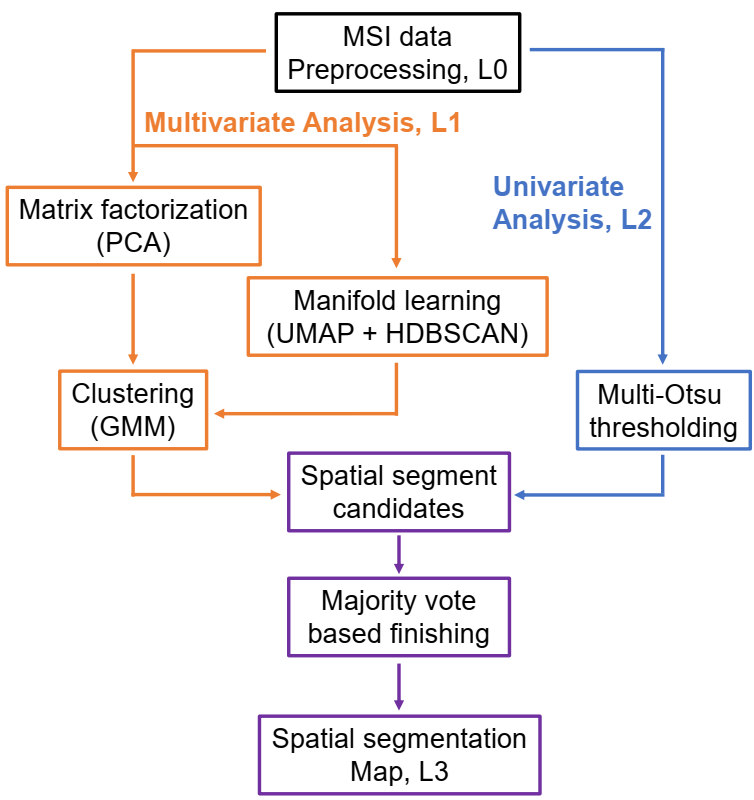

# MSI-segmentation

It is a data processing pipeline for mass spectrometry imaging (MSI) segmentation by combining multivariate clustering and univariate thresholding. 

The pipeline comprises four independent data processing modules, as illustrated as follows. First, we perform data preprocessing, in which line scan alignment, peak picking, normalization, and ion image visualization are performed to organize MSI data for downstream data mining. Next, pixels are clustered based on their spectral similarity in multivariate analysis. In particular, both PCA and UMAP are applied: the former generates compressed features for GMM clustering, while the latter helps estimate the number of clusters. Given these inputs, GMM is repeatedly fitted, assigned with a range (5) of mixture component numbers around UMAP estimation. In parallel, ion images that are poorly represented in multivariate analysis are independently partitioned using multi-Otsu thresholding. As a result, ensemble generation of both multivariate and univariate analyses approximates a pool of spatial segment candidates. Finally, we assemble the segmentation map. 

Herein we limit the user effort to validation and selection of segment candidates. Computational results are exported in forms of .csv and .png. Results are also visualized by Tkinter interactive interface. You may set parameters and select segment candidates by editing config.py. Representative results of a mouse kidney section data set are as follows. 

Ion image collection (A), UMAP 2D embedding (B) and PCA scree plot (C) produced by L0 module. (D) ion image thresholding analysis. (E) Ensemble segment candidates generated by both multivariate clustering and univariate thresholding. (F) The final segmentation map. 

# Requirements
numpy 1.18.1
pandas 1.1.0
matplotlib 3.1.3
mplcursors 0.3
tkinter 8.6
scikit-learn 0.22.1
scikit-image 0.16.2
umap-learn 0.3.10
despike 0.1.0

# How to use 
## Data preparation
Flatten the MSI image sets as input data. 2D spatial indexes are kept in first two columns. 

## Main programs
Run MSI-segmentation_LX modules sequentially, outputs of one module may be the input for the following module. Edit corresponding levels in config.py along the pipeline. 

*MSI-segmentation_L0.py* 
Show ion images, reduce the dimensionality of MSI data by PCA and UMAP. 

*MSI-segmentation_L1.0.py* 
Multivariate clustering by Gaussian mixture model.

*MSI-segmentation_L1.1.py (validation)* 
Show clustering results by interactive tkinter interface. 

*MSI-segmentation_L2.0.py* 
Univariate thresholding by multi-Otsu thresholding algorithm.

*MSI-segmentation_L2.1.py (selection)* 
Binarization of selected ion images with selected thresholding labels. 

*MSI-segmentation_L3.0.py (validation)* 
Show ensemble segment candidates by interactive tkinter interface. 

*MSI-segmentation_L3.1.py (selection)* 
Assemble the final segmentation map. 

